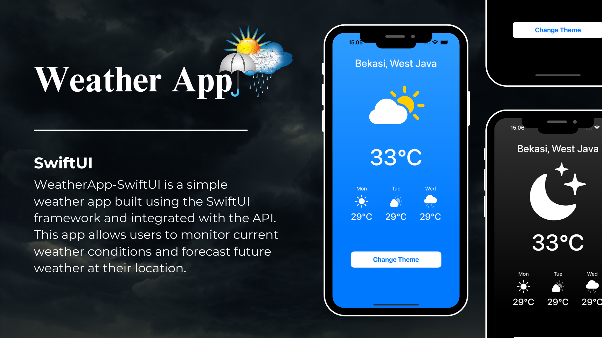

# WeatherApp-SwiftUI

WeatherApp-SwiftUI is a simple weather app built using the SwiftUI framework. This app allows users to monitor current weather conditions and forecast future weather at their location.

## Main feature

- Displays current weather conditions, including temperature, humidity, wind speed and overall weather conditions.
- Provides future weather forecasts to help users plan daily activities.
- Integrated with https://weatherapi-com.p.rapidapi.com to ensure accurate and up-to-date weather information.
- Equipped with dark mode and light mode

## Installation

1. Clone this repository to your machine's locale.
2. Open the project using Xcode.
3. Make sure you have a RapidAPI account and get the API key for https://weatherapi-com.p.rapidapi.com.
4. Visit the API provider for information about API connections.
5. Run the application on your simulator or device.

## Contribute

If you would like to contribute to this project, please fork the repository and create a pull request with your changes.
